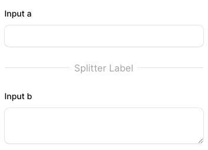

# green-support

Copyright &copy; Kobesoft, Inc. All rights reserved.

## 概要

これはGreenEngineの管理画面システムの共通モジュールです。
filamentphpに様々な機能を追加します。

下記のモジュールを提供します。

- 便利なTraits
- viewのカスタマイズ

## インストール

composerでインストール

```shell
composer install kobesoft/green-support
```

作成していないなら、テーマを作成する。

```shell
php artisan make:filament-theme
```

tailwind.config.jsを編集する。

```js:/resources/css/filament/admin/tailwind.config.js
import preset from '../../../../vendor/filament/filament/tailwind.config.preset'

export default {
    presets: [preset],
    content: [
        './app/Filament/**/*.php',
        './resources/views/filament/**/*.blade.php',
        './vendor/filament/**/*.blade.php',
        './vendor/kobesoft/**/*.blade.php',
    ],
}
```

作成したテーマを適用する。

```php:/app/Providers/Filament/AdminPanelProvider.php
    $panel
        // :
        ->viteTheme('resources/css/filament/admin/theme.css');
        // :
```

## Modelトレイト

### HasGetOptions

全ての選択肢を取得するメソッドを提供します。
プルダウン選択肢の項目として利用する場合に便利です。

デフォルトで、idとnameのカラムを利用します。
選択肢の表示を変更する場合は、`TITLE`定数をオーバーライドしてください。

```php
use Kobesoft\GreenCommon\Traits\HasGetOptions;

class Prefecture extends Model
{
    use HasGetOptions;

    const TITLE = 'name_jp';
}
```

選択肢を取得する場合は、`getOptions`メソッドを利用してください。

```php
$prefectures = Prefecture::getOptions();
```

選択肢に条件を追加する場合には、`getOptions`メソッドの引数にクロージャを与えてください。

```php
$prefectures = Prefecture::getOptions(function ($query) {
    $query->where('area_id', '=', 1);
});
```

### HasSortOrder

並び順があるモデルに利用します。

デフォルトで、`sort_order`カラムを利用します。
並び順のカラムを変更する場合は、`SORT_ORDER`定数をオーバーライドしてください。

```php
use Kobesoft\GreenCommon\Traits\HasSortOrder;

class Category extends Model
{
    use HasSortOrder;
    
    const SORT_ORDER = 'sort_order';
}
```

```php
$categories = Category::defaultOrder()->get();
```

なお`sort_order`カラムの初期値は、`id`カラムの値となります。

### HasNodeOptions

NestedSetモデルの全ての選択肢を取得するメソッドを提供します。
プルダウン選択肢の項目として利用します。

HasGetOptionsとの違いは、階層構造を持つモデルに対応している点です。
getOptionsメソッドの引数の$htmlをtrueにすると、階層構造を表現したHTMLを返します。

## FormComponent

### Splitter

`Splitter`は、フォームの入力項目を分割して表示するためのコンポーネントです。



```php
use Kobesoft\GreenCommon\FormComponent\Splitter;

public static function form(Form $form): Form
{
    return $form
        ->schema([
            //:
            \Green\Forms\Components\Splitter::make()
                ->label('Splitter Label'),
            //:
        ])
        ->columns(1);
}
```

